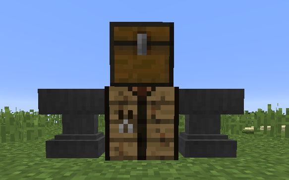

# JustMinions

JustMinions is a project of Kiwi111 (with Jogius being a mental support and learning Java by doing). It is a Minecraft Plugin
whose goal it is to introduce functionality similar to the SkyBlock Minions on the Hypixel Minecraft Server.

## Installation

Create a Server using [Spigot](https://getbukkit.org/get/Fpt2yFn7HRTrot5uE1b8NFWtpQlYITgK) and either download the
precompiled jar file or compile it yourself using our source code.

## Usage

### Commands
**/inv**  
Opens the inventory used to craft minions (can also be opened using the Crafting Terminal Structure)

**/minion**

Works with three different arguments: place, remove and number. "place" places a minion with a
diamond block as its helmet. "remove" removes all the minions in a one block range 
of the player. "number" prints the number of all the minions on the server.

### Recipes
All the recipes can be crafted in the crafting terminal.  

**Minion Recipes**

Recipes for all the things a minion needs including the "MinionPlacer" and the "Minion" 

**Compressed Blocks**

Compressed blocks aren't available for every block just for the ores, wood, stone and slime. They are always
crafted with the block form of the item. They are used to define the type of a minion.

### Minions   
**Requirements**

To place a minion, a "MinionPlacer", a "Minion" and a compressed block are needed.

**Placing**

To place a minion just have a "Minion" in your inventory, a compressed block in you off hand
and the "MinionsPlacer" in the main hand. The "MinionPlacer" has infinite uses while the "Minions" and
the compressed block will be consumed (just one if a stack is used).

**Working**

The minion will start working right after being placed, if a 5*5 area below it is free or has the same blocks
as its head. The block the minion stands on can be of any type. At first, the minion will start placing
blocks in the area below it. When the area is full of blocks with the right type, it will destroy a random
block within the area. Then, the minion will fill up the space again. Different minions need different amounts
of time for an action. The items will just drop so you can use build hoppers or something similar to collect the items.

**Removing**

To remove a minion just right click it to open an inventory. Then, you can click the red wool, the minion will disappear.
Another way is to use the minion command. Don't destroy it with attacks in creative mode!

### Structures
**Crafting Terminal**  

## Contributing
Pull requests are welcome but will probably be processed slowly. If you find major bugs or have a great idea to add,
please open an issue to discuss the problems or changes.

## License
None
